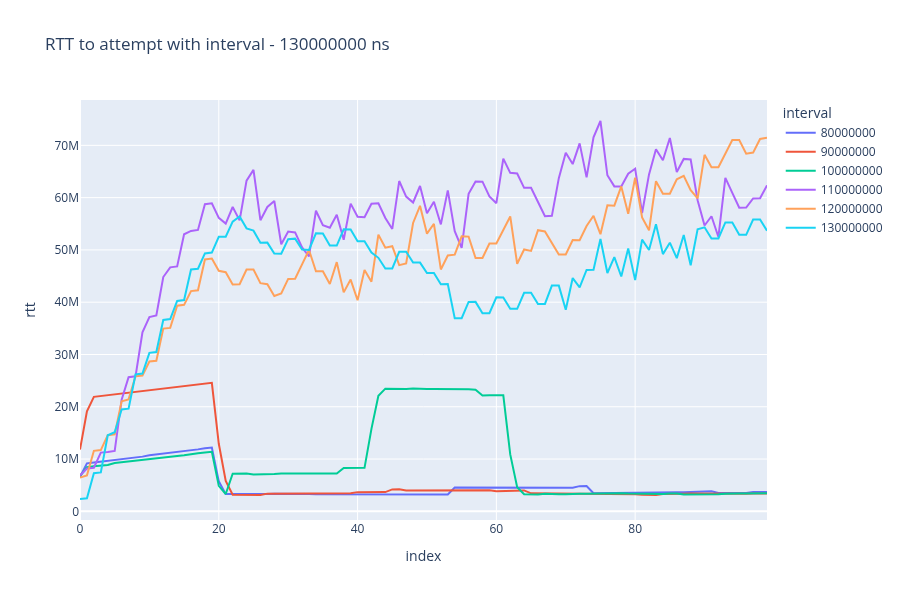
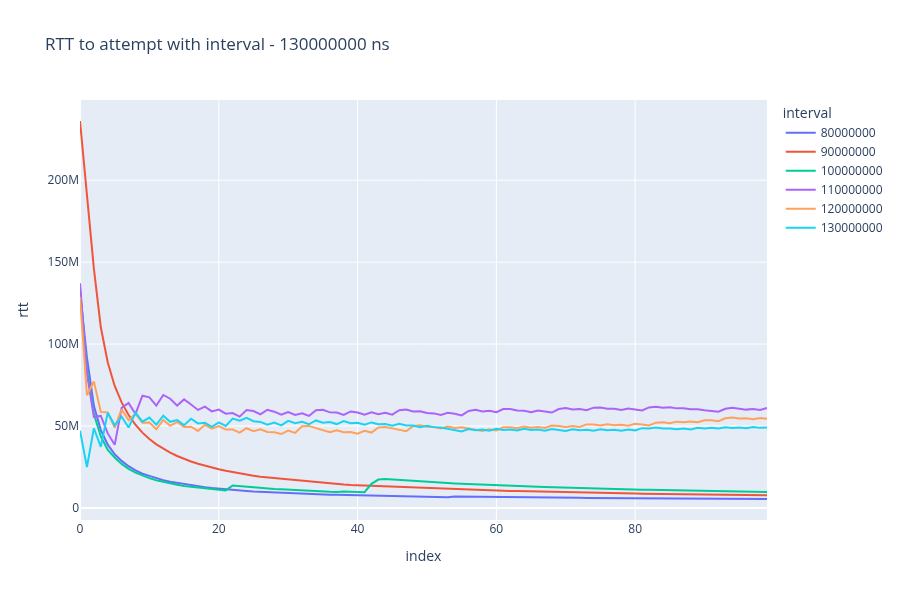
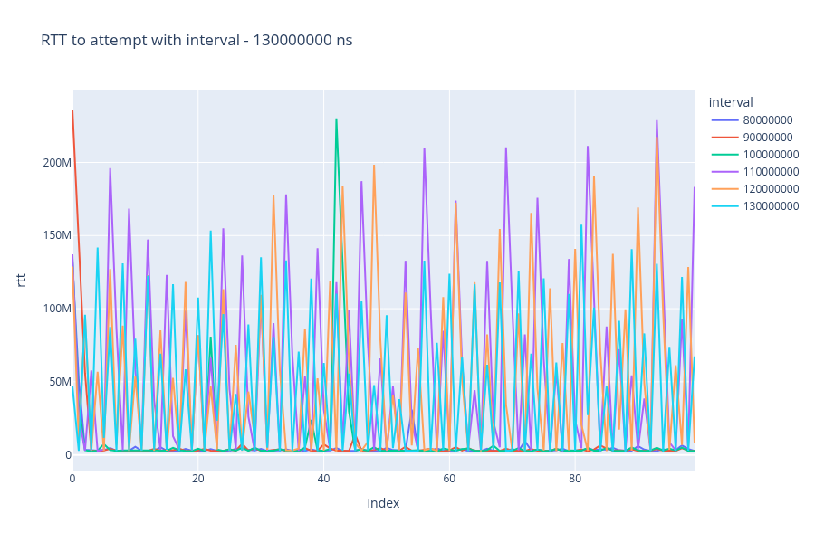

# Изучение зависимости RTT от интервала отправки UDP пакетов

## Структура репозитория

- [client/](./client/) - код клиента
- [server/](./server/) - код сервера
- [images/](./images/) - сохраненные графики
- [data/](./data/) - результаты экспериментов
- [main.ipynb](main.ipynb) - ноутбук, в котором производился анализ данных

## Описание экспериментального стенда

Клиент отправляет в теле пакета информацию о локальном времени отправки пакета в наносекундах, и затем, когда асинхронно читает ответ сервера, использует это значение для подсчёта RTT.

Рассчет проводился при следующих условиях:

- Количество отправленных пакетов в прогоне - 100
- Прогон производился при данных интервалах
  - 80000000
  - 90000000
  - 100000000
  - 110000000
  - 120000000
  - 130000000
- Каждый прогон проводился только после перезапуска сервера

## Условия проведения стенда

- Сервер - на ноутбуке, подключенный через Wi-Fi
- Клиент - на стационарном компьютере, подключенный через Ethernet кабель к Wi-Fi роутеру

## Результаты экспериментов

Данные прогонов находятся в папке [data/](./data/).

### График среднего RTT на последних двадцати попытках

На данном графике изображено среднее RTT за последние 20 попыток для каждого из экспериментов.
В значении `color` указывается длина интервала в наносекундах.

### График среднего значения RTT на всех попытках до

На данном графике изображено среднее RTT на всех попытках на префиксе для каждого из экспериментов.
В значении `color` указывается длина интервала в наносекундах.

### График RTT от попытки отправки пакета

На данном графике изображено значение RTT конкретной попытке отправки пакета для каждого из экспериментов.
В значении `color` указывается длина интервала в наносекундах.

## Выводы

При переходе интервала от 100мс до 110мс резко возрастает средний RTT.
При маленьких значениях интервала оно стабилизируется около 3.5 мс, но при увеличении до 110+ мс RTT начинает регулярно выпадать в высокие значения, из-за чего усреднённый RTT за последние 20 попыток начинает колебаться около значений в 50мс.
